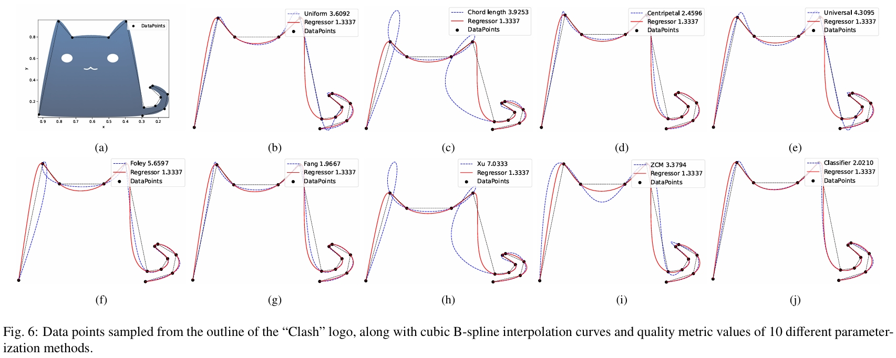
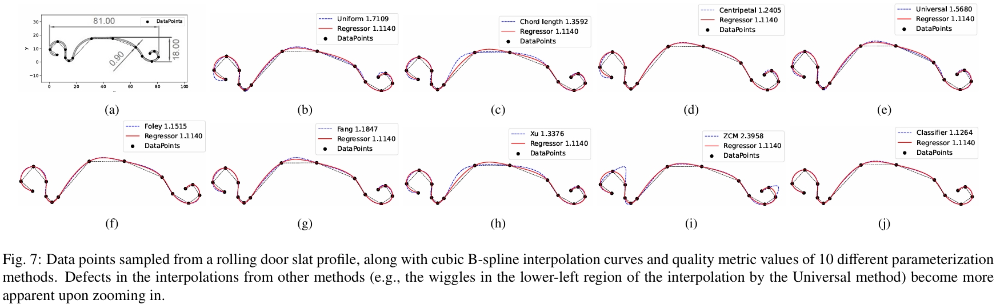

# A parametrization method for B-spline curve interpolation via supervised regression

**Authors:** Shangyi Lin, Jieqing Feng*  
**Contact:** jqfeng@cad.zju.edu.cn (Corresponding author)  

---

This repository contains code and data associated with the paper *"A parametrization method for B-spline curve interpolation via supervised regression"*.

## Requirements

### Operating System
- Windows 10 or 11

### C++ Requirements
- **Windows SDK Version:** 10.0
- **Platform Toolset:** Visual Studio 2022 (v143)
- **C++ Language Standard:** ISO C++14 (`/std:c++14`)

For more detailed instructions on setting up the development environment, please refer to the full guide in [cpp_requirements.md](./cpp_requirements.md).

### Python Requirements
Python dependencies can be installed by running the following commands:

```
cd src-py
setup_env.bat
```

## Project Structure

The repository contains source code in two languages:
- **C++ source files**: Located in `src-cpp/`
- **Python source files**: Located in `src-py/`

## Compilation Instructions

The main C++ files are located in `src-cpp/B-spline-curve-fitting/main_scripts/`.

1. Clone the repository to a local path (e.g., `D:\BSplineLearning`).
2. Update the `PROJECT_ROOT` path:
   - In C++: modify the macro `PROJECT_ROOT` in `src-cpp/B-spline-curve-fitting/alg_Interpolation.h`.
   - In Python: modify the string `PROJECT_ROOT` in `src-py/dataset.py`.

### To compile and run a specific C++ program:

1. Copy the desired main C++ file from `src-cpp/B-spline-curve-fitting/main_scripts/`.
2. Paste it into `src-cpp/B-spline-curve-fitting/`.
3. Rename the file to `main.cpp`.
4. Compile and run the program.

## Dataset

The dataset zip files may be downloaded from the following links:

- [Primary link](https://www.jianguoyun.com/p/DUtEX0IQyZLMDRie-osGIAA)
- [Backup link](https://pan.baidu.com/s/1m03oEMxxfQ2SKXc240UPnQ?pwd=54xu) (password: 54xu)

Unzip the datasets and place them directly under the `PROJECT_ROOT` directory.

## Method Replication and Evaluation

Follow these steps to replicate the method described in the paper:

### 1. Dataset Generation
- **Regression dataset**: Run `src-cpp/B-spline-curve-fitting/main_scripts/main-0. generating data with regression labels.cpp`
- **Classification dataset**: Run `src-cpp/B-spline-curve-fitting/main_scripts/main-9. generating data with class labels.cpp`

### 2. Classifier Training and Inference
1. Train the classifier: `src-py/training/classifier_training.py`
2. Run inference: `src-py/inference/classifier_inference.py`

### 3. Method Testing (Paper Implementation)
1. Run training script: `src-py/training/main_del_feat.py`
2. Run prediction script: `src-py/inference/seq_pred_del_feat.py`
3. Execute test script: `src-cpp/B-spline-curve-fitting/main_scripts/main-5. test script.cpp`

### 4. Curve Visualization
1. Generate curve data: `src-cpp/B-spline-curve-fitting/main_scripts/main-6. record crvs and params.cpp`
2. Plot interpolating curves: `DrawNurbs2D.py`

### 5. GA-Optimized Knot Vectors Testing
1. Run training: `src-py/training/main_del_feat.py`
2. Run prediction: `src-py/inference/seq_pred_del_feat.py`
3. Test with optimized knots: `src-cpp/B-spline-curve-fitting/main_scripts/main-7. ga-optimized knots.cpp`

### 6. Classification Method Comparison
Compare with idealized classifier approach:
1. Run training: `src-py/training/main_del_feat.py`
2. Run prediction: `src-py/inference/seq_pred_del_feat.py`
3. Execute comparison: `src-cpp/B-spline-curve-fitting/main_scripts/main-8. superior count.cpp`

### 7. Meaningful Examples (Representative Figure Replication)
Test the proposed method on illustrative examples, such as the "clash" logo or rolling door slats, and reproduce the figures below
1. Run prediction: `src-py/inference/meaningful_example.py`
2. Generate curve data: `src-cpp/B-spline-curve-fitting/main_scripts/main-10. meaningful example.cpp`
3. Plot interpolating curves: `DrawMeaningfulExample.py`




## Method Validation

These steps validate the method's performance and optimize parameters:

### 1. Parameter Optimization
Determine optimal parameters for regression models:
1. Grid search training: `src-py/training/grid_train.py`
2. Grid validation: `src-py/inference/grid_val.py`
3. Parameter testing: `src-cpp/B-spline-curve-fitting/main_scripts/main-1. param grid test.cpp`

### 2. Regression Model Evaluation
1. Run training: `src-py/training/main_del_feat.py`
2. Run prediction: `src-py/inference/seq_pred_model_val.py`
3. Execute tests: `src-cpp/B-spline-curve-fitting/main_scripts/main-2. testing regression models.cpp`

### 3. Feature Selection and Dataset Size Optimization
1. Run training: `src-py/training/test_dataset_size_feat_model.py`
2. Run prediction: `src-py/inference/seq_pred_datasize_val.py`
3. Execute tests: `src-cpp/B-spline-curve-fitting/main_scripts/main-3. feat and dataset size.cpp`

### 4. Local Stage Sequence Length Optimization
1. Run training: `src-py/training/local_length_test_del_feat.py`
2. Run prediction: `src-py/inference/local_len_metric_del_feat.py`
3. Execute tests: `src-cpp/B-spline-curve-fitting/main_scripts/main-4. testing local len.cpp`

## Usage Notes

- Ensure all dependencies are installed for both Python and C++ components
- Follow the sequential execution order for each workflow
- The C++ compilation step must be repeated for each different main script you wish to run